# Redis

# 1. Redis 윈도우 설치

## 1-1. Redis 실행하기

## 1-2. Redis 서비스 설정 하기

### 1-2-1. 포트 변경

### 1-2-2. 비밀번호 변경

### 1-2-3. 외부 접근 허용 IP 설정

### 1-2-4. 메모리 최대 크기 설정

### 1-2-5. log 파일 설정

# 2. Spring boot Redis 활용   

## 2-1. Redis 


# 1. Redis 윈도우 설치

Redis 다운로드 페이지인 [Redis](https://github.com/microsoftarchive/redis/releases, "Redis download") 로 이동하여 설치 프로그램을 다운로드하고 설치를 진행한다.

- 1. 다운로드 페이지

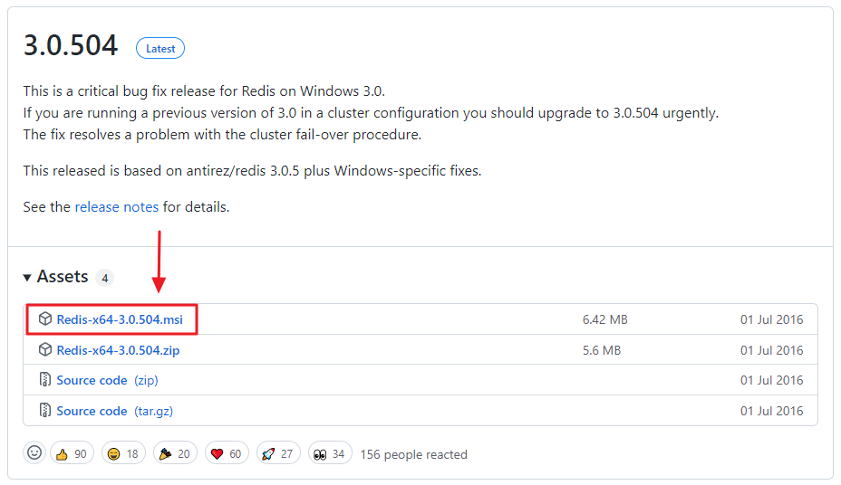 <br>

- 2. 첫 번째 설치 화면

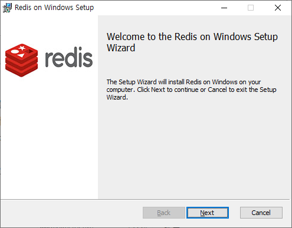 <br>
                
- 3. 설치 디렉토리 선택/변경 화면

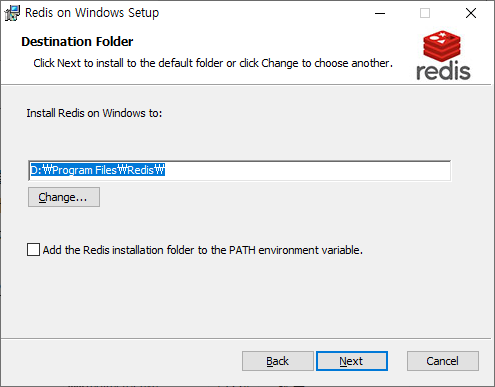 <br>
                    
- 4. 포트번호 확인/변경 화면

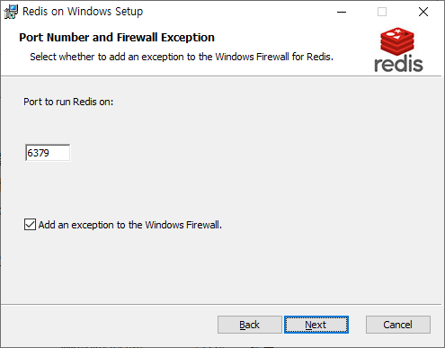 <br> 
                
- 5. 메모리 최대 사용량 활성화 및 설정 화면

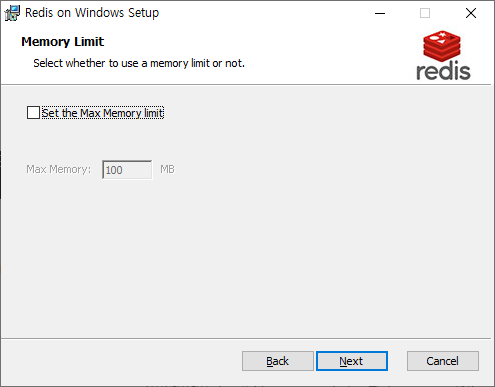 <br> 

| <span style="font-size:24px;font-weight:bold">&#128161; Point</span> |
|---------------------------------------------------------------------|
| Redis의 기본(Default) 포트(Port)는 6379 이다. |
        

<br><br><hr><br><br>

## 1-1. Redis 실행하기

설치가 완료되면 서비스에 자동으로 등록되어 실행되며, 작업관리자(Ctrl+Shift+ESC 키)의 서비스 탭에서 확인이 가능하다.<br>

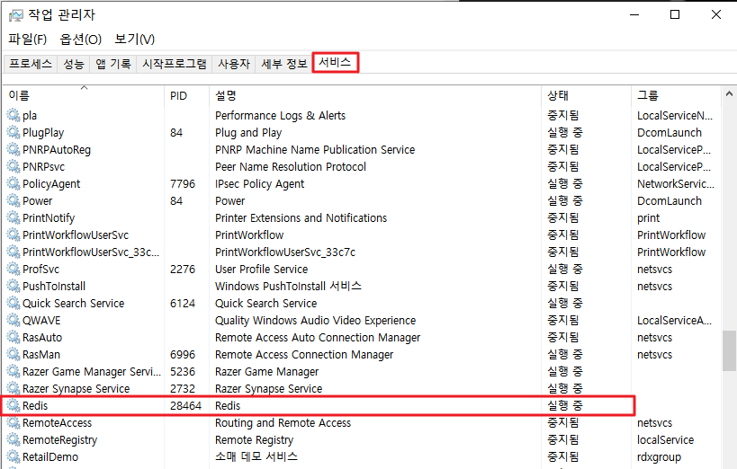 <br> 
 
만일 윈도우 서비스를 사용 하지 않는다고 하면 직접 redis-server.exe 파일을 실행해 수동으로 레디스 서버를 실행 시킬 수 도 있다.<br>

파일은 설치경로(C:\Program Files\Redis)에 들어있다.<br>

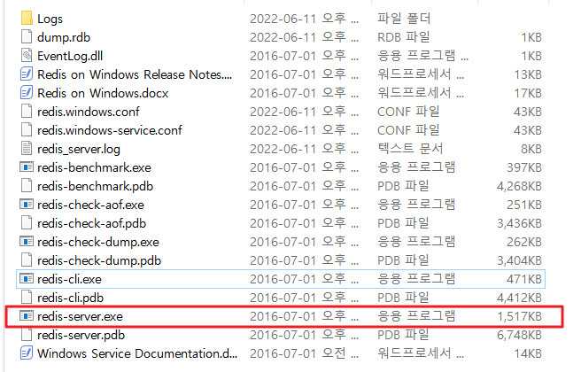 <br> 
 
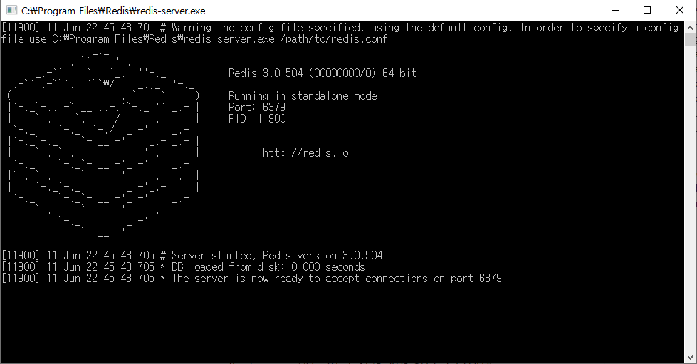 <br> 

레디스 서버(Redis Server)를 실행 시켰다면, 레디스 명령어를 사용할수 있는 redis-cli.exe을 실행시킨다.

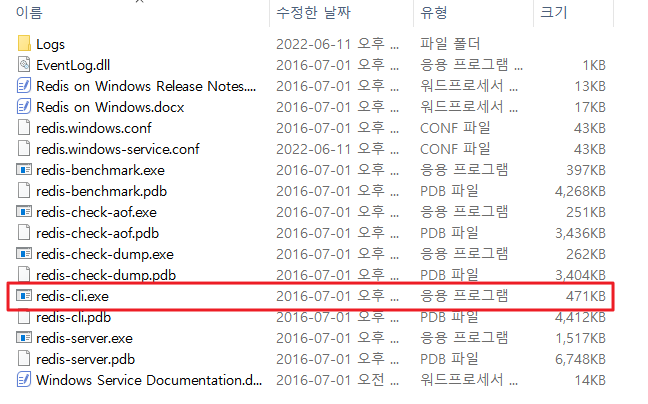 <br> 


터미널이 뜨면, 레디스가 잘 작동이 되는지 테스트 해본다.

ping 명령어를 입력하여 확인(PONG)이 가능하다.

set 명령어로 데이터를 key-value 형태로 입력이 가능하며 get으로 조회할 수 있다.

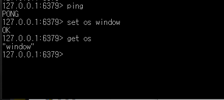 <br> 


<br><br><hr><br><br>

## 1-2. Redis 서비스 설정 하기
redis는 기본 6379 포트로 동작이 된다.
만일 포트 번호를 바꾸고 싶다면 <span style="color:red;font-weight:bold">redis.windows-service.conf</span> 파일에서 수정할 수 있다.
이외에도 다양한 설정들이 들어 있다.

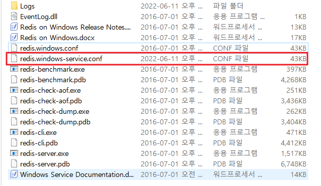 <br> 
			
| <span style="font-size:24px;font-weight:bold">&#128161; Point</span>  |
|--------------------------------------------------------------------------------|
| redis conf 설정 파일 차이점<br><br>redis.windows-service.conf : 서비스/데몬으로 실행될때 실행되도록 되어 있다.<br>백그라운드에서 실행되고 OS에 의해 관리된다.<br><br>redis.windows.conf : 명령줄이나 스크립트에서 실행되고 사용자 공간에서 관리된다. |


<br><br><br>
 
### 1-2-1. 포트 변경

redis.window.conf 파일을 열어서 'port'라고 검색해보면 아래와 같이 기본 포트 6379로 설정되어 있는 것을 확인할 수 있다.<br>
6379 부분을 원하는 포트 번호로 변경해주면 된다.

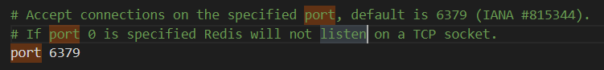 <br> 

<br><br><br>
 
### 1-2-2. 비밀번호 변경

비밀번호는 redis.window.conf 파일에서 'requirepass'을 검색하면 주석 처리가 되어져 있다.<br>
처음 redis를 사용하면 기본 비밀번호가 설정되지 않은 상태이고, 이 주석 부분을 풀어서 'foobared' 부분을 원하는 비밀번호로 설정하면 된다.

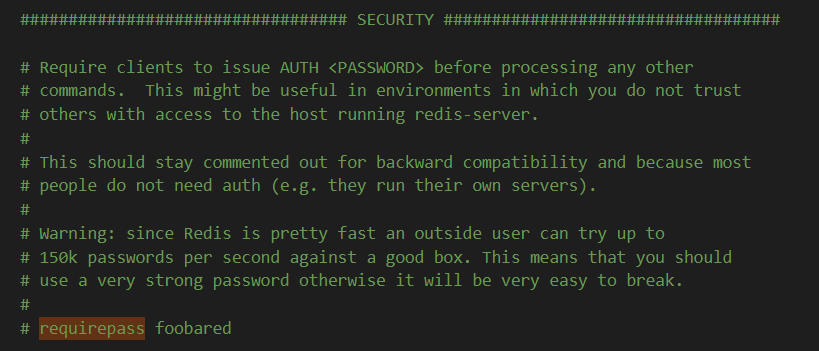 <br> 

비밀번호를 설정했으면, 나중에 레디스를 실행할때 다음과 같이 패스워드를 넣어주면 된다.<br>

```
shell> auth 패스워드Copy
```

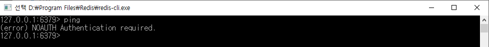 <br> 

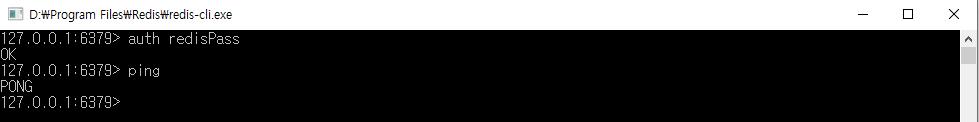 <br> 

<br><br><br>
 
### 1-2-3. 외부 접근 허용 IP 설정

bind 부분을 주석 해제하고 허용 아이피를 정해주면 된다.

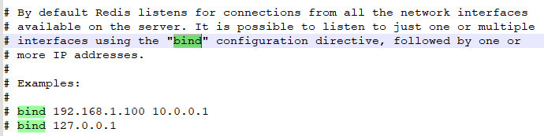 <br> 


<br><br><br>
 
### 1-2-4. 메모리 최대 크기 설정

redis 데이터베이스 자체 메모리를 차지하는 것이므로 maxmemory를 설정할 수 있다.<br>
redis.window.conf 파일을 열어서 'maxmemory'라고 검색하면 주석 쳐져 있는 maxmemory 부분을 볼 수 있다.<br>

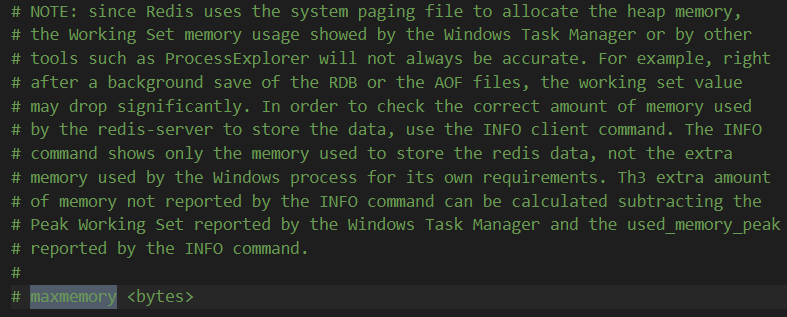 <br> 

<br><br><br>
 
### 1-2-5. log 파일 설정

기본으로 redis.windows.conf 파일에 log 파일이 생기지 않도록 logfile 값이 "" 빈문자열로 되어 있다.<br>
이것을 찾아서 아래와 같이 어떤 파일로 log를 기록할 것인지 작성하고 실행하면 redis가 실행된 것에 대한 log 파일이 생성된다.<br>

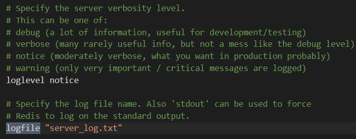 <br> 

<br><br><br>

설정을 맞췄으면 작업 관리자  →  서비스 탭에서 레디스(Redis) 재시작을 하면 자동으로 window-service.conf 파일 설정대로 초기화 된다.

 <br> 


 
만일 윈도우 서비스로 Redis를 사용하지않고 수동으로 관리하고 싶다면, 서비스 탭에서 Redis 서비스를 종료하고, redis.window.conf 파일을 수정하고 터미널에서 직접 커맨드로 실행하면 된다.
shell> cd C:\Program Files\Redis

<br><br><hr><br><br>

# 2. Spring boot Redis 활용  

## 2-1. 새 프로젝트 생성
